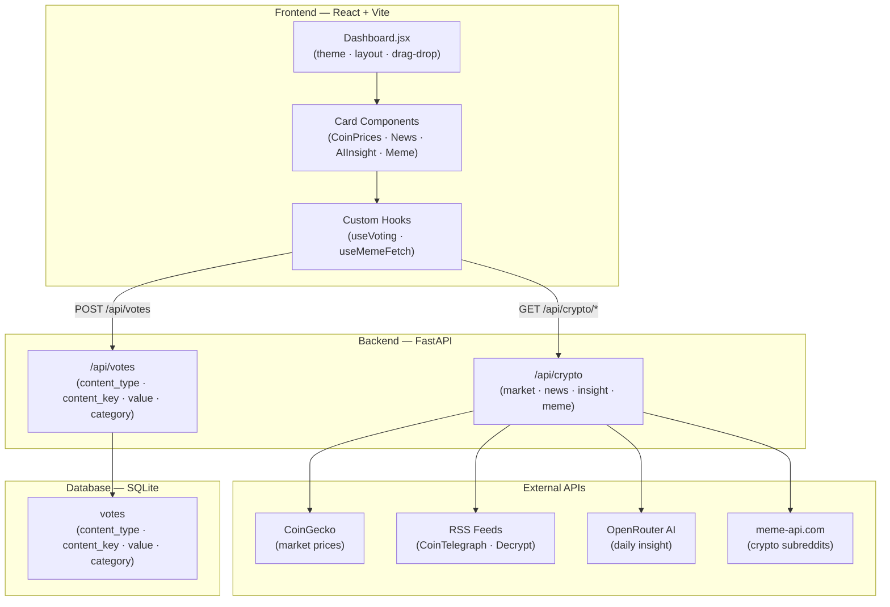

# ai-crypto-advisor-ori

## Architecture

```mermaid
flowchart TD
    subgraph Frontend["Frontend — React + Vite"]
        Dashboard["Dashboard.jsx\n(theme · layout · drag-drop)"]
        Cards["Card Components\n(CoinPrices · News · AIInsight · Meme)"]
        Hooks["Custom Hooks\n(useVoting · useMemeFetch)"]
    end

    subgraph Backend["Backend — FastAPI"]
        CryptoRouter["/api/crypto\n(market · news · insight · meme)"]
        VotesRouter["/api/votes\n(content_type · content_key · value · category)"]
    end

    subgraph ExternalAPIs["External APIs"]
        CoinGecko["CoinGecko\n(market prices)"]
        RSS["RSS Feeds\n(CoinTelegraph · Decrypt)"]
        OpenRouter["OpenRouter AI\n(daily insight)"]
        RedditMeme["meme-api.com\n(crypto subreddits)"]
    end

    subgraph DB["Database — SQLite"]
        VotesTable["votes\n(content_type · content_key · value · category)"]
    end

    Dashboard --> Cards
    Cards --> Hooks
    Hooks -->|"GET /api/crypto/*"| CryptoRouter
    Hooks -->|"POST /api/votes"| VotesRouter
    CryptoRouter --> CoinGecko
    CryptoRouter --> RSS
    CryptoRouter --> OpenRouter
    CryptoRouter --> RedditMeme
    VotesRouter --> VotesTable
```