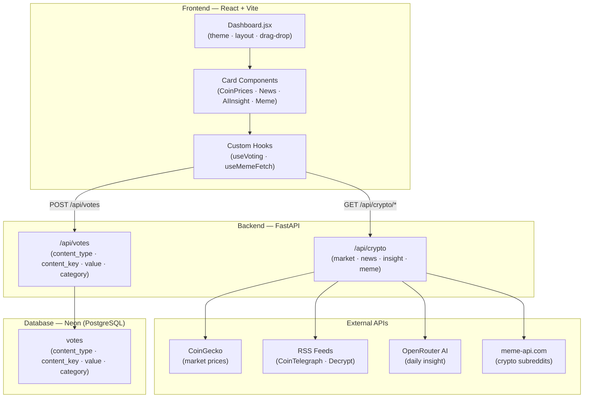

# ai-crypto-advisor-ori

## AI Use Declaration

I used Claude (Anthropic) as a coding assistant during this project. This section describes honestly how I used it and where the thinking was mine.

### How I actually worked

I started by planning the architecture on my own — I decided on React + Vite for the frontend and FastAPI + SQLite for the backend before writing a line of code. I chose FastAPI because I wanted Python on the backend (for the eventual ML layer) and had used Flask before, so I researched alternatives and picked FastAPI for its speed and automatic docs. I chose SQLite because it is zero-config and suitable for a single-user project at this scale.

Once I had the structure in my head, I used Claude to help me write boilerplate faster — things like the drag-and-drop card layout, the Tailwind styling, and wiring up the API client. I described what I wanted and reviewed every output before using it.

### Decisions I made, not AI

- **The voting schema** (`content_type`, `content_key`, `value`, `category`) — I designed this specifically to support the ML recommendation plan. AI did not suggest this structure; I chose it because I knew I needed category-level telemetry to build user vectors later.
- **The meme categorization logic** — I wrote the keyword lists for `bull_market`, `bear_market`, and `animal_coins` myself based on what I actually see in crypto communities.
- **The news fallback chain** (CryptoNews API → CryptoPanic → RSS → static fallback) — I researched each of these APIs, found their docs, and decided the priority order. AI did not know the correct API response shapes; I read the docs and corrected the integration myself.
- **Phased ML approach** — My decision after thinking through the alternatives (see `BONUS_ML_PLAN.md`).

### Bugs I fixed myself that AI got wrong

- The Reddit meme API (`meme-api.com`) sometimes returns `.mp4` URLs without setting the `isVideo` flag. AI's first version only checked the flag, so videos were being passed as images and breaking the image tag. I noticed this in testing, traced it to the API response, and added the `.endswith(".mp4")` check myself.
- The OpenRouter free-tier model ID — AI suggested model names that no longer exist on the free tier. I went to the OpenRouter docs, found the current free model, and updated the config.
- Several CORS issues between Vite dev server (port 5173) and FastAPI (port 8000) that required reading the FastAPI CORS middleware docs to fix correctly.

### What AI helped with

Translating my ideas into working JSX and Python faster than I could type it. The visual design (Tailwind classes, gradients, card layout) where I described the look I wanted and iterated on the output. Debugging tracebacks where the error message was clear but the fix was tedious to write.

---

## Architecture

## Deployment

| Layer | Service | Why |
|-------|---------|-----|
| Frontend | Vercel | Global CDN, native Vite/React build, deploys on every push |
| Backend | Railway | Straightforward FastAPI/Python hosting, free tier, env vars injected securely |
| Database | Neon.tech | Serverless PostgreSQL, free tier without credit card, zero idle cost |

Environment variables set at the platform level (never in the repo):
- `DATABASE_URL` — Neon PostgreSQL connection string (set in Railway)
- `OPENROUTER_API_KEY` — AI provider key (set in Railway)
- `VITE_BACKEND_URL` — Railway backend URL (set in Vercel)